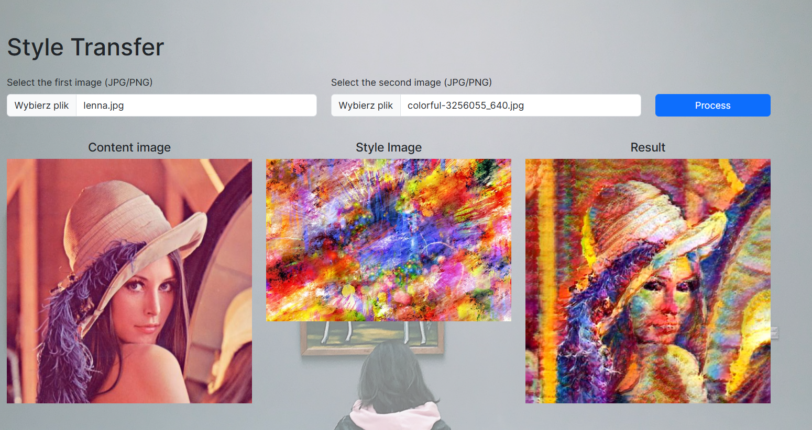

# Transfer Style

Web application that transforms images by applying artistic styles using deep learning. Based on the paper [Arbitrary Style Transfer in Real-time with Adaptive Instance Normalization](https://arxiv.org/abs/1703.06868).

## Prerequisites

- Node.js (v14 or higher)
- Python 3.11
- Conda (Miniconda or Anaconda)

## Installation

### Backend Setup

```bash
cd backend
conda env create -f environment.yml
conda activate transfer-style
uvicorn server:app --reload
```

### Frontend Setup

```bash
cd frontend
npm install
npm start
```

## Usage

1. Open `http://localhost:3000`
2. Upload content image
3. Upload style image
4. Click "Generate"

## Example result



## Tech Stack

- Backend: FastAPI + PyTorch
- Frontend: React + Bootstrap
- Model: AdaIN architecture trained on WikiArt and MSCOCO datasets

## Acknowledgments

Based on the work of Huang et al. (ICCV 2017) and uses pre-trained VGG models.
